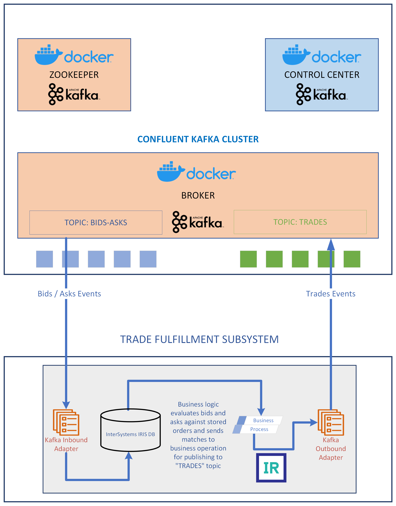

# iris-native-kafka-docker
Demonstrate integration of InterSystems IRIS (version 2022.1 or later) running natively with Kafka running in a container either on the same host or remotely. 

The Kafka cluster is adapted from the docker-composition sepcified [here](https://developer.confluent.io/quickstart/kafka-docker/). Control center container adds a GUI, albeit with limited use for this solution.

This solution assumes that the reader is familiar with the basics of creating a namespace on InterSystems IRIS and executing ObjectScript code within a terminal session. No prior knowledge of KAFKA is required.

## Prerequisites
Make sure you have [git](https://git-scm.com/book/en/v2/Getting-Started-Installing-Git) and [Docker desktop](https://www.docker.com/products/docker-desktop) installed.

## Installation 

Clone/git pull the repo into any local directory

```
$ git clone https://github.com/isc-krakshith/iris-native-kafka-docker.git
```
Open a command line in this directory and run:
```
$ docker-compose build
$ docker-compose up -d
```
### Wait for KAFKA cluster to be ready
Zookeeper, Broker and Control Center will each be running in their own containers. Navigate to [KAFKA Control Center](http://<host_running_container>:9021)
You will need for the cluster to become stable before it is ready for use. Reload the page on the browser unitl the cluster is showing as healthy.
## Solution


## How to Use it
### On your native InterSystems IRIS instance
Login on [InterSystems IRIS Management Portal](http://<ip_address_of_iris>:<webserver_port_of_iris>/csp/sys/UtilHome.csp) on your browser
#### a. Create an interoperability enabled namespace called KAFKA with default settings
#### b. Import src/Kafka/KafkaProduction.xml
#### c. Open IRIS terminal session and change to KAFKA namespace and popluate some random KAFKA orders
For instance on an UNIX based installation:
```
$ iris session <name_of_Iris_instance>
USER> zn "KAFKA"
KAFKA> do ##class(Kafka.Data.Orders).Populate(500)
```
#### If Kafka cluster is running remotely ie. on a different host than InterSystems IRIS, change the Kafka Settings in the production. Otherwise skip to Start the Production
Navigate to [Kafka.TraderProduction](http://<ip_address_of_iris>:<webserver_port_of_iris>/csp/kafka/EnsPortal.ProductionConfig.zen?PRODUCTION=Kafka.TraderProduction)
Click on the EnsLib.Kafka.Service. Then on the right panel in the Settings tab, expand the Kafka Settings and uodate the Server field with "<external_ip_address_of_host_running_kafka_cluster>:9092"
Click "Apply" button.
Then make an identical change to EnsLib.Kafka.Operation and "Apply"
#### Start the Production
Navigate to [Kafka.TraderProduction](http://<ip_address_of_iris>:<webserver_port_of_iris>/csp/kafka/EnsPortal.ProductionConfig.zen?PRODUCTION=Kafka.TraderProduction), and click the "Start" button
### Produce and consume events via shell sessions in the Kafka container
#### EXECUTE 2x CONTAINER SHELLS
++++++++++++++++++++++++++
```
docker-compose exec broker bash
```
##### BASH 1 : CREATE AND PRODUCE EVENTS ON A TOPIC
In the first shell... (commands in ./confluentKafka/ProduceBidsAsks.sh)
```
$ /bin/kafka-topics --create --topic bids-Asks --bootstrap-server localhost:9092
$ /bin/kafka-console-producer --topic bids-Asks --bootstrap-server localhost:9092
```
##### BASH 2 : CONSUME EVENTS FROM A TOPIC
In the second shell...(commands in ./confluentKafka/ConsumeTrades.sh)
```
$ /bin/kafka-console-consumer --topic trades --bootstrap-server localhost:9092
```
##### BASH 1 : PRODUCE EVENTS
Go back to the first shell...
Then generate bid-ask events, one line at a time... After each event is produced, the resulting trades topic events are visbile the second shell described above as well as in the Management Portal (Select any of the components of the production by clicking once -> On the right hand pane, select the "Messages" tab, then any of the messages in the list to explore them in depth)
```
{"dateTime":"2022-06-07T13:16:22.000","ref":"OH77BBN3", "security":"SECA", "bid":50, "ask":0, "vol":300}
```
```
{"dateTime":"2022-06-07T13:17:32.000","ref":"OH77CBN3", "security":"SECB", "bid":0, "ask":50, "vol":400}
```
```
{"dateTime":"2022-06-07T13:18:42.000","ref":"OH77DBN3", "security":"SECC", "bid":0, "ask":55, "vol":200}
```
```
{"dateTime":"2022-06-07T13:19:52.000","ref":"OH77EBN3", "security":"SECD", "bid":70, "ask":0, "vol":250}
```
## What's inside the repository

### Dockerfile

Dockerfile which starts IRIS and imports Installer.cls and then runs the Installer.setup method, which creates KAFKA Namespace and imports ObjectScript code from /src and /testdata folders into it.

### .vscode/settings.json

Settings file to let you code in VSCode with [VSCode ObjectScript plugin](https://intersystems-community.github.io/vscode-objectscript/)

### .vscode/launch.json
Config file if you want to debug with VSCode ObjectScript

#### Start InterSystem IRIS terminal to test it
```
$ iris session <name_of_Iris_instance>
USER> zn "KAFKA"
KAFKA> do ##class(Kafka.TestKafkaMessagingClient).KafkaClient()
```